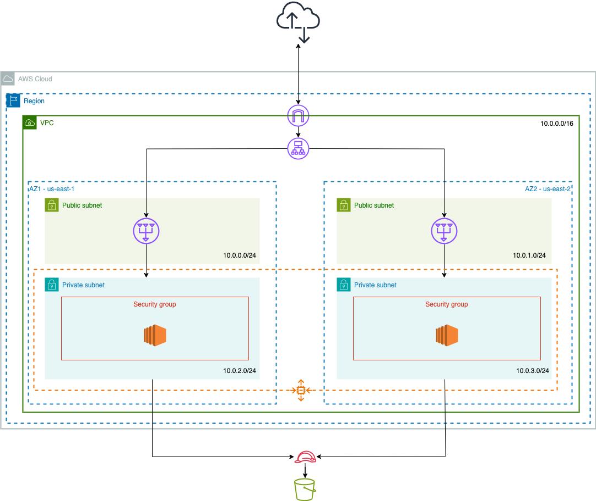
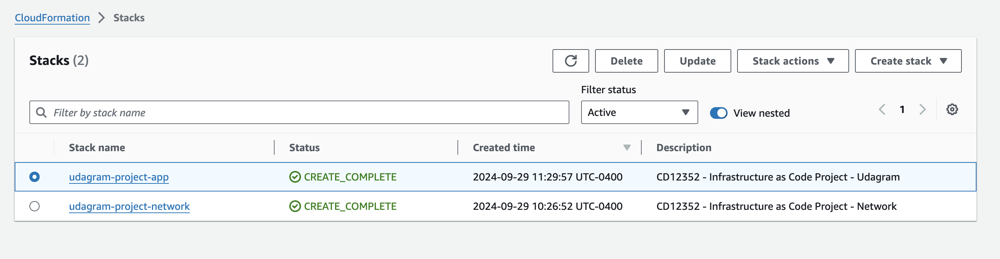
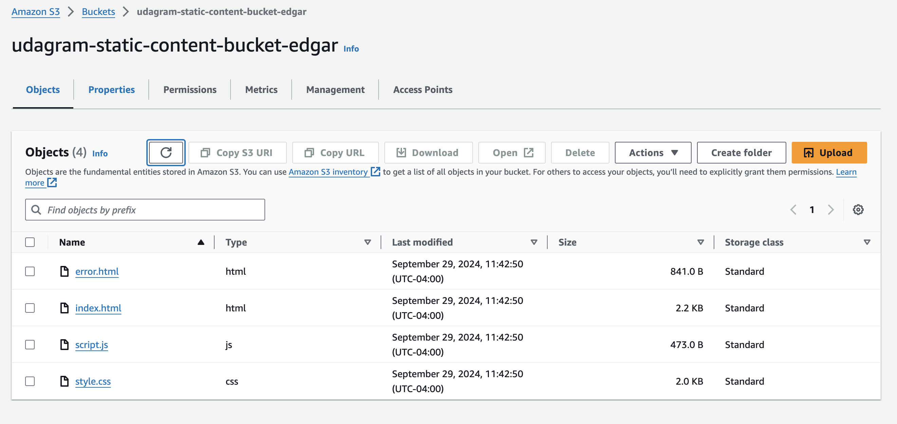
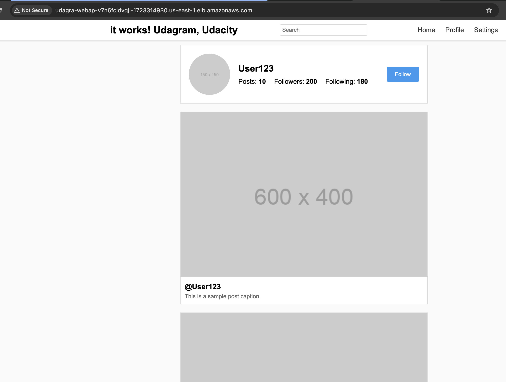

# CD12352 - Infrastructure as Code Project
# Edgar Aranda

## Project
Udagram (a high-availability web app using CloudFormation)

### Overview 
This project involves creating a highly available and scalable infrastructure on AWS using infrastructure as code (CloudFormation). The solution includes a VPC with public and private subnets, an EC2 Auto Scaling Group, a Load Balancer, and an S3 bucket for hosting static content. 

The architecture will be divided into two CloudFormation templates: one for networking resources and another for application-specific resources. The infrastructure will be created and managed programmatically, ensuring consistency and ease of deployment.

## Diagram



## Setup Instructions

### Pre-requisites
- Make sure that AWS CLI is installed and configured before running the commands below
- Make sure you have that your IAM account has the correct permissions and that you have SSM installed and configured
  
#### Download
Clone the git repository
```sh
git clone https://github.com/eoaranda/Udacity-IAC-Udagram-Project.git
cd Udacity-IAC-Udagram-Project
```

#### Script Permissions
To make sure that the files in the `scripts` folder are executable, you can use the following command:
```sh
chmod -R +x scripts
```

### Spin up 
- Once you have ran the templates, the `create` script will automatically copy the `html\` content to your s3 bucket

#### If we want to use a specific Profile and Region, you can send them as the last 2 parameters:
To spin up the network run the following command in your terminal:
```sh
./scripts/create.sh create-network udagram-project us-east-1 udacity
```

To spin up the application run the following command in your terminal:
```sh
./scripts/create.sh create-app udagram-project us-east-1 udacity
```

#### If you want to use Default values you can omit this parameters:
To spin up the network run the following command in your terminal:
```sh
./scripts/create.sh create-network udagram-project
```

To spin up the application run the following command in your terminal:
```sh
./scripts/create.sh create-app udagram-project
```

### Tear down (Delete)
To tear down (or delete) the network run the following command in your terminal:
```sh
./scripts/delete.sh delete-network udagram-project us-east-1 udacity 
```

To tear down (or delete) the application run the following command in your terminal:
```sh
./scripts/delete.sh delete-app udagram-project us-east-1 udacity 
```

#### If you want to use Default values you can omit this parameters:
To tear down (or delete) the network run the following command in your terminal:
```sh
./scripts/delete.sh delete-network udagram-project
```

To tear down (or delete) the application run the following command in your terminal:
```sh
./scripts/delete.sh delete-app  udagram-project
```

## Expected Result Example:

### Udagram Stack


### Udagram S3 Bucket


### Udagram Application 

